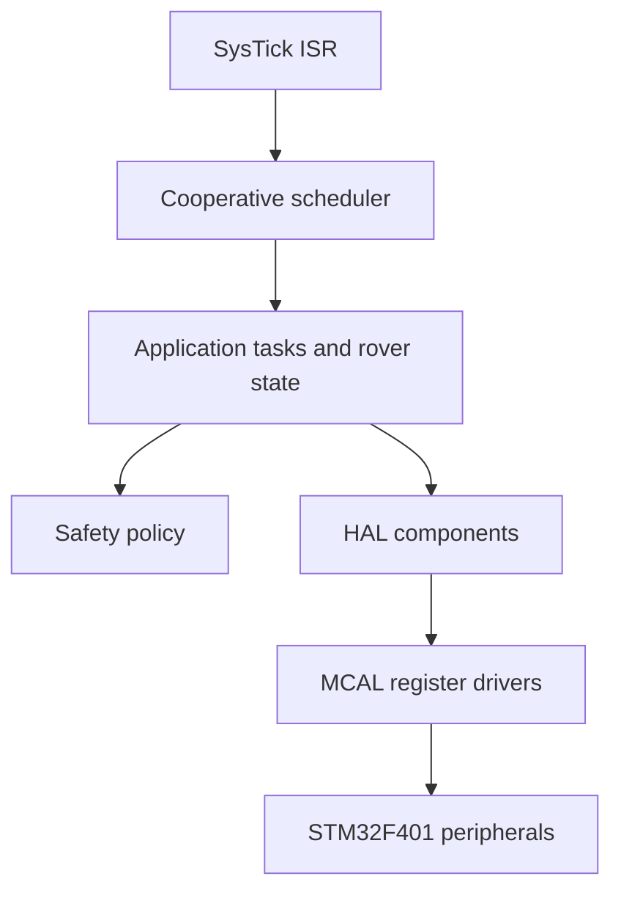

# Architecture

## System view

The project follows a mostly layered structure: reusable library definitions sit below MCAL register drivers, HAL components compose those drivers, the scheduler dispatches application callbacks, and `main.c` owns system composition. The architecture is practical rather than a strict build-enforced dependency boundary; several modules include configuration and private headers directly.

## LIB

`include/LIB/STD_TYPES.h` supplies project integer aliases such as `u8`, `u16`, and `u32`. `include/LIB/UTILS.h` provides bit operations such as set, clear, toggle, and read. These abstractions reduce repeated register-mask code and make the driver source resemble the ITI register-programming exercises.

## MCAL

The MCAL maps STM32 registers with C structures and fixed peripheral base addresses. Implemented modules include RCC, GPIO, NVIC, EXTI, SysTick, TIM, USART, and SPI. Configuration is primarily compile-time through `*_config.h` files. The drivers configure clocks, alternate functions, timer modes, communication registers, and interrupt enable bits without relying on STM32 HAL APIs for the application peripherals.

## HAL

The HAL converts peripheral operations into component-level interfaces. Examples include `MOTOR_SHIELD_Init`, `BTM_SendString`, `ULTRASONIC_GetDistance`, `SERVO_SetAngle`, `ST7735_DrawLine`, `STP_StartAutoRefresh`, and buzzer event functions. Additional reusable HAL modules are present for ESP8266, IR remote, DAC, seven-segment, and SH5461AS displays.

## Scheduler and application

`OS_program.c` maintains ten task slots indexed by priority. SysTick sets a volatile flag; `OS_Update()` clears the flag and executes ready callbacks in priority-index order from the foreground loop. This is cooperative scheduling, not preemptive scheduling. The application uses callbacks for control, ultrasonic safety, display generation, telemetry, radar scanning, TFT rendering, and buzzer updates.

## Zero-blocking claim

The main rover path is organized around periodic callbacks and does not use a generic delay in the application task table. However, the repository also contains blocking loops in low-level transfers and explicit delay-based buzzer helper functions. Therefore, the accurate claim is **mostly non-blocking application scheduling with blocking primitives still present in selected drivers and legacy helpers**.

## Startup sequence

`main()` initializes RCC and peripheral clocks, initializes the active HAL components, configures PWM and communication peripherals, registers tasks, starts the OS, and repeatedly calls `OS_Update()`. The exact call order should be reviewed with the hardware connected because several modules assume their peripheral clock has already been enabled.
